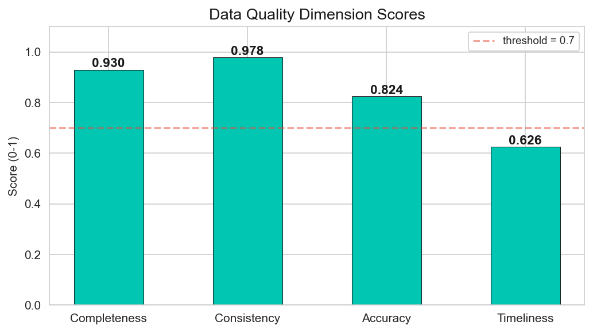
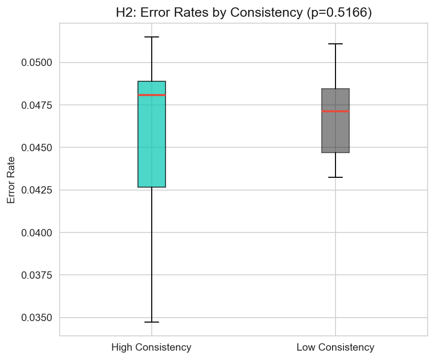
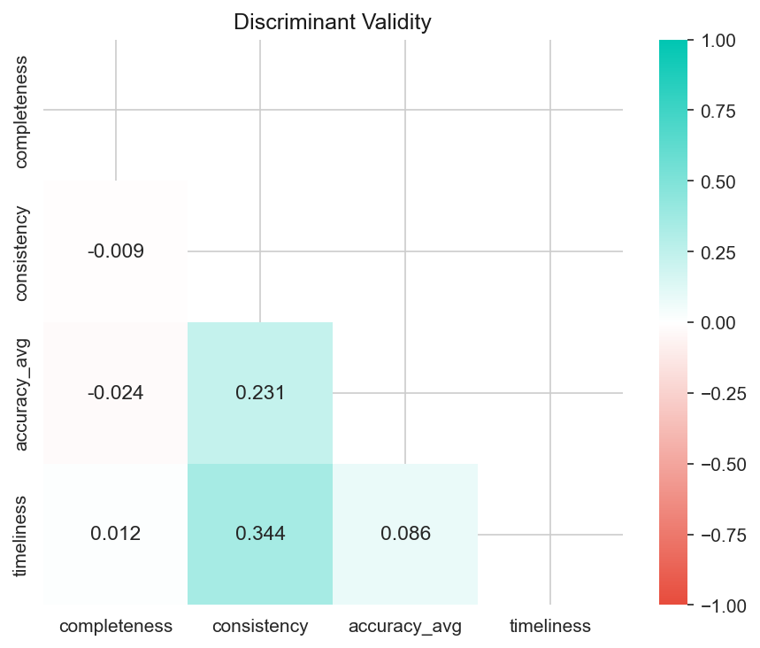

# Quantifying Data Quality: A Statistical Framework for Scoring and Monitoring Scientific Datasets

A statistical framework that quantifies data quality across four dimensions — **Completeness**, **Consistency**, **Accuracy**, and **Timeliness** — each scored on a 0–1 scale. Applied to the [UCI Air Quality Dataset](https://archive.ics.uci.edu/ml/datasets/Air+Quality) (9,357 hourly environmental observations).

Built as part of the **Quantitative Data Analysis** module at FOM Hochschule, Essen (Summer Semester 2026).

---

## Research Question

> How can data quality be quantified, scored, and monitored using a statistical framework?

Four hypotheses derived from Wang & Strong (1996), Pipino et al. (2002), Batini & Scannapieco (2016), and Heinrich et al. (2018).

---

## Dataset & Cleaning

**Source:** UCI Air Quality Dataset (De Vito, 2016) — 9,358 hourly sensor readings from an Italian city (2004–2005), featuring 5 gas sensors + certified reference analyzers.

**Pipeline:** Sentinel fix (-200 → NaN) → Drop NMHC(GT) (90% missing) → IQR + z-score outlier flagging (retained as real events) → Final: 9,357 rows × 12 numeric columns.


---

## Data Quality Dimensions

| Dimension | Formula | Score | Source |
|-----------|---------|-------|--------|
| Completeness | `1 − (missing / total)` | **0.930** | Pipino et al. (2002) |
| Consistency | `1 − (violations / checks)` | **0.978** | Batini & Scannapieco (2016) |
| Accuracy | `1 − (MAE / range)`, normalized | **0.824** | Heinrich et al. (2018) |
| Timeliness | `e^(−0.01 × age_days)` | **0.626** | Batini & Scannapieco (2016) |

Three of four dimensions exceed the 0.7 acceptability threshold. Timeliness scores lowest due to dataset age (2004–2005).



---

## Descriptive Statistics & Correlations


Key correlations: CO ↔ Benzene (r = 0.93), CO ↔ PT08.S1 (r = 0.88), Temperature ↔ Humidity (r = −0.58).


---

## Hypothesis Testing

### H₁: Completeness ↔ Usability
- **Method:** Pearson correlation
- **Result:** r = 0.998, p < 0.001 → **Supported**


### H₂: Consistency → Error Reduction
- **Method:** Welch t-test
- **Result:** p = 0.517 → **Not supported**



### H₃: DQI Internal Reliability
- **Method:** Cronbach's alpha
- **Result:** Low α → Expected for a multidimensional framework (each dimension captures something different)

### H₄: Temporal Data Drift
- **Method:** Kolmogorov-Smirnov test
- **Result:** 7/8 columns show significant drift → **Supported**


---

## Regression Analysis

**Question:** Can DQ scores predict sensor error?

Predictors: Completeness, Consistency, Timeliness (Accuracy excluded to avoid circularity).

- **R² = 0.013** (test set) | **CV R² = −0.275** (5-fold)
- DQ scores measure structural quality, not sensor calibration — they answer different questions.


### BLUE Assumptions (Field, 2018)

| Assumption | Test | Result |
|-----------|------|--------|
| Linearity | F-test | ✅ Met |
| No multicollinearity | VIF (all < 5) | ✅ Met |
| Normality | Shapiro-Wilk | ❌ Violated (expected at large n) |
| Homoscedasticity | Breusch-Pagan | ❌ Violated (expected at large n) |
| Independence | Durbin-Watson | ✅ Met |


---

## Validity



- **Content validity:** Dimensions grounded in established DQ literature
- **Convergent validity:** Consistency correlates positively with accuracy (0.231) and timeliness (0.344)
- **Discriminant validity:** All inter-dimension correlations < 0.85 — each dimension captures unique information

---

## Tech Stack

- **Python 3.9** — pandas, numpy, scipy, statsmodels, scikit-learn, pingouin
- **Visualization** — matplotlib, seaborn
- **Statistical tests** — Pearson correlation, Welch t-test, Cronbach's α, Kolmogorov-Smirnov, OLS regression

## How to Run

```bash
pip install -r requirements.txt
jupyter notebook Data_Quality_Analysis.ipynb
```

---

## References

- Batini, C., & Scannapieco, M. (2016). *Data and information quality*. Springer.
- Cronbach, L. J. (1951). Coefficient alpha and the internal structure of tests. *Psychometrika*, 16(3), 297–334.
- De Vito, S. (2016). Air quality dataset. UCI Machine Learning Repository.
- Field, A. (2018). *Discovering statistics using IBM SPSS statistics* (5th ed.). Sage.
- Heinrich, B., Kaiser, M., & Klier, M. (2018). Does the data quality really matter? *Journal of Business Economics*, 88(5), 615–651.
- Massey, F. J. (1951). The Kolmogorov-Smirnov test for goodness of fit. *JASA*, 46(253), 68–78.
- Pipino, L. L., Lee, Y. W., & Wang, R. Y. (2002). Data quality assessment. *Communications of the ACM*, 45(4), 211–218.
- Wang, R. Y., & Strong, D. M. (1996). Beyond accuracy: What data quality means to data consumers. *JMIS*, 12(4), 5–33.
